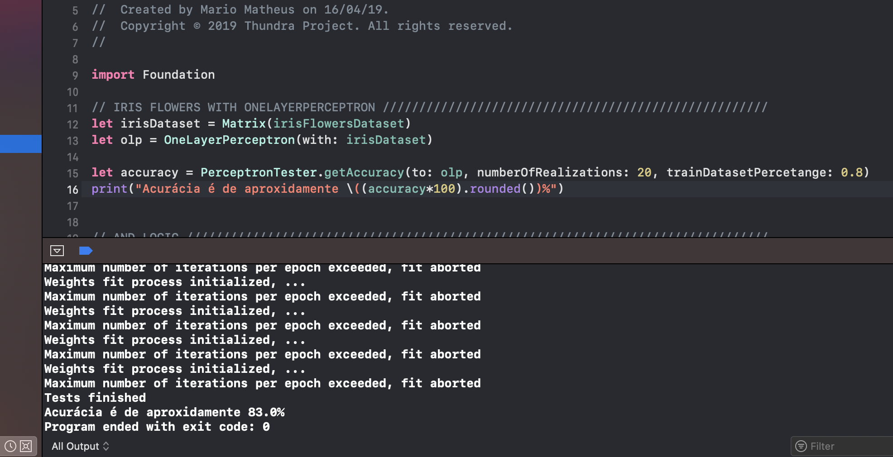

# LearningRNAs
Perceptrons in Swift

## Content
The project contains a Simple Perceptron and One Layer Perceptron implementation in Swift.  
Using the Iris Flower Dataset, the project using a PerceptronTester, tests perceptron accuracy and printing on the screen.

## License
The project does not need a license :)
